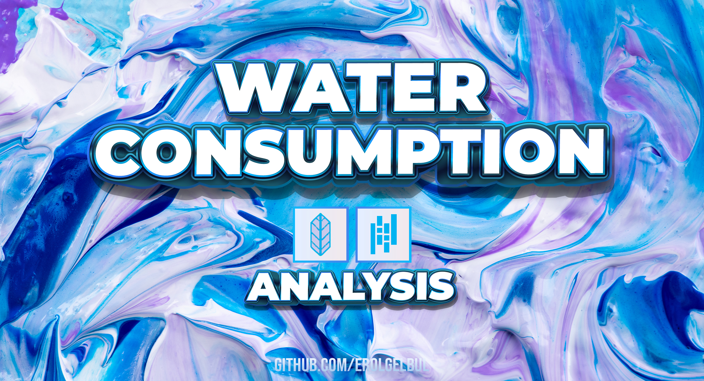
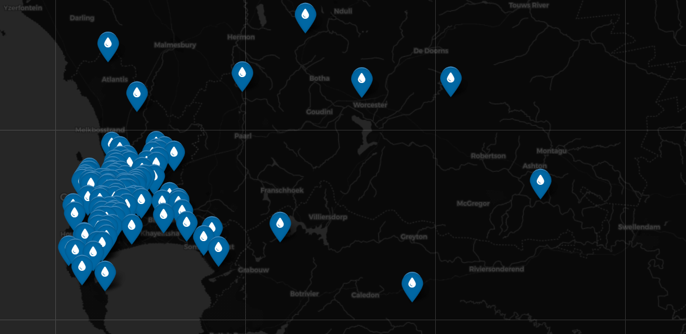
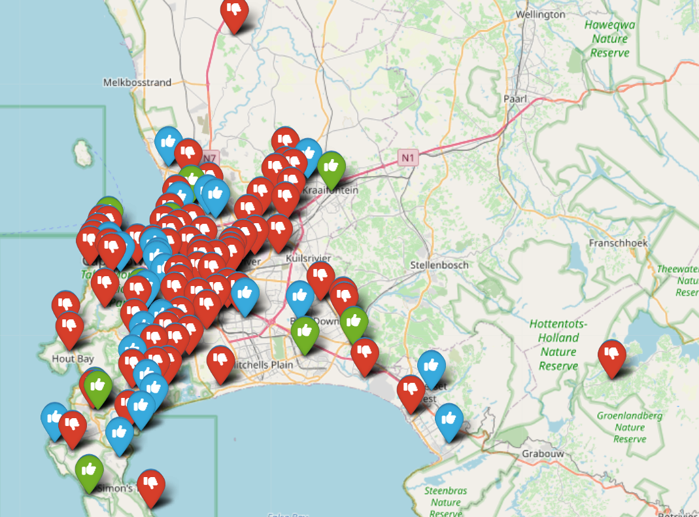
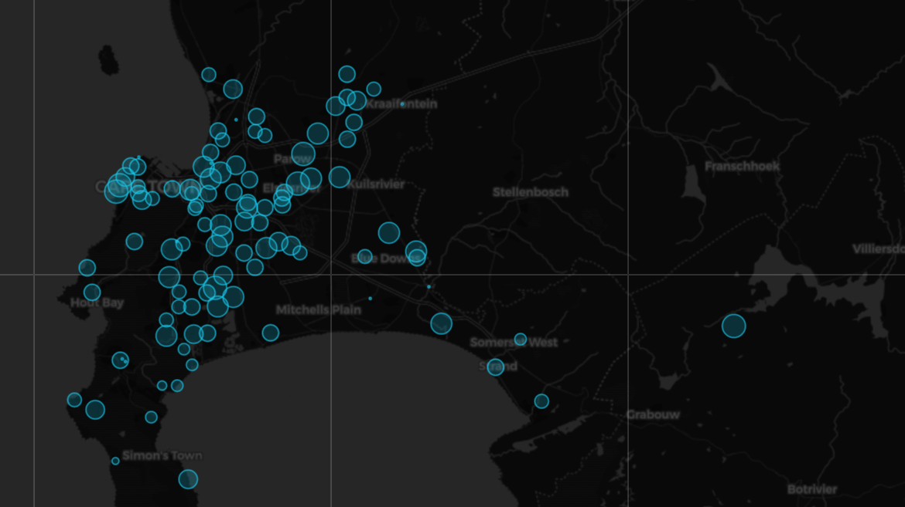
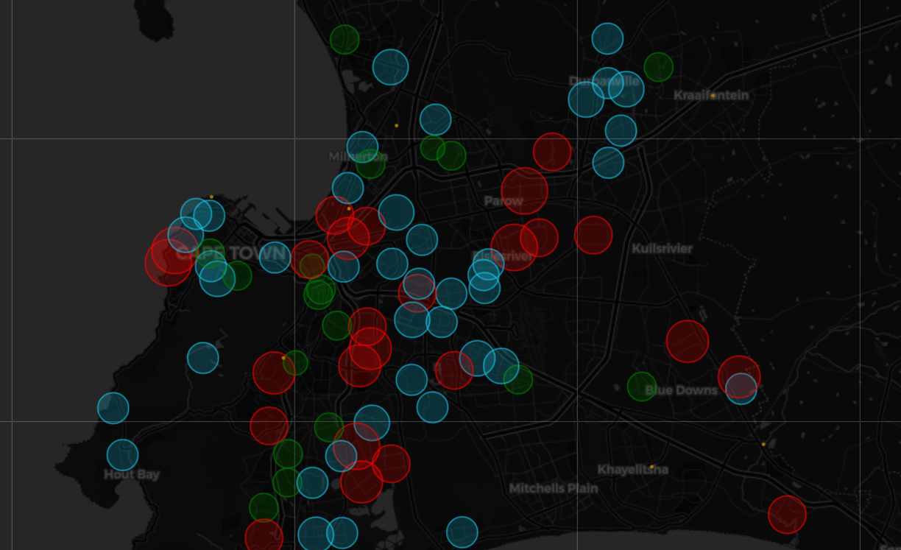
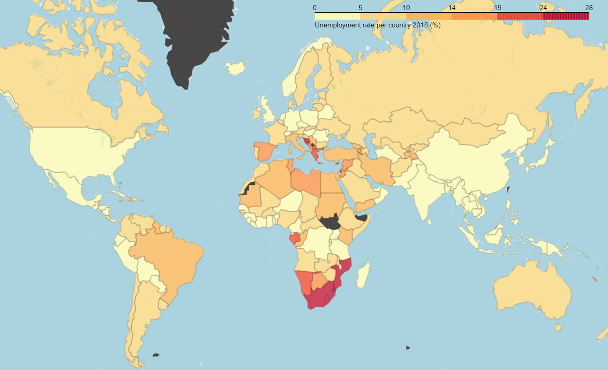
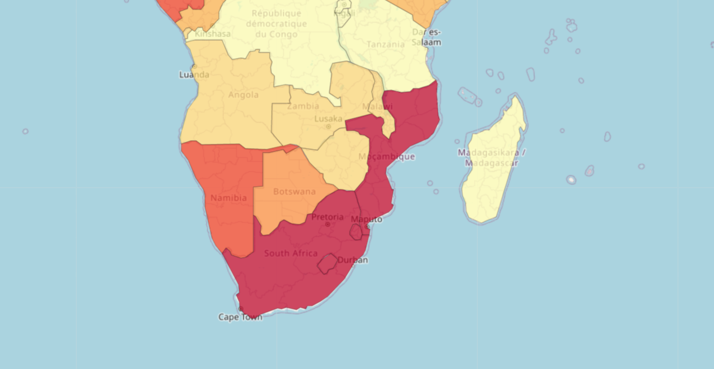
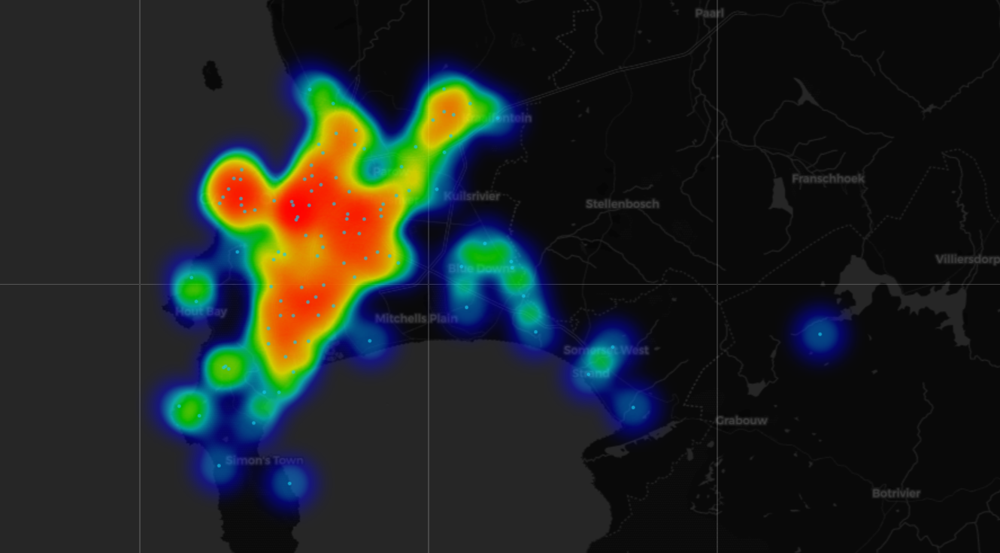

  

<!-- ABOUT THE PROJECT -->
##  1. Introduction

### 1.1 Overview

This project aims to analyze and visualize water consumption in different
suburbs using data collected in October 2017. By examining the water consumption
levels of single-residential properties, the study provides insights into the
usage patterns across various locations. Using Python and the Folium library,
the project creates interactive maps to display the suburbs with different
levels of water consumption. These maps offer a visually engaging way to compare
and draw conclusions about water usage patterns.

  

### 1.2 Components

Data Collection: The project uses a database containing information on the
number of single-residential properties, water consumption in kiloliters per
month, and geographical coordinates (latitude and longitude) for each suburb.

Data Processing: The dataset is processed using Python to extract relevant
information such as the latitude and longitude coordinates of the suburbs and
their water consumption levels in October 2017.

Data Visualization: Interactive maps are generated using the Folium library,
displaying markers for each suburb. The markers are color-coded and include
icons to represent different water consumption levels:

### 1.3 Libraries

- Data preprocessing: [Pandas](https://pandas.pydata.org/)
- Mapping library: [Folium](https://python-visualization.github.io/folium/)

## 2. Data Analysis

### 2.1 Database

Database is about single-residential properties in various suburbs,
with information on water consumption (in kiloliters per month), as well as
geographical coordinates (latitude and longitude). The data is from October
2017. The columns in the database are:

- Suburb: The name of the suburb.
- Number of single-residential properties_number: The number of single-residential properties in the suburb.
- kl/month: Water consumption in kiloliters per month for the specified suburb in October 2017.
- Month: The month in which the data was recorded (October).
- Year: The year in which the data was recorded (2017).
- Latitude: The latitude coordinate of the suburb.
- Longitude: The longitude coordinate of the suburb.atabase appears to be about single-residential properties in various suburbs, with information on water consumption (in kiloliters per month), as well as geographical coordinates (latitude and longitude).

### 2.2 Markers

  

This visualization can help users identify areas with different levels of water
consumption at a glance, allowing them to make comparisons or draw conclusions
about water usage patterns in the suburbs.

1. If the water consumption in October 2017 is less than 5 kl/month, the suburb
marker will have a green color with a thumbs-up icon.

2. If the water consumption in October 2017 is between 5 and 8 kl/month
   (inclusive), the suburb marker will have a blue color with a thumbs-up icon.

3. If the water consumption in October 2017 is greater than 8 kl/month, the suburb
marker will have a red color with a thumbs-down icon.

### 2.3 Point Map

  

For each suburb, the circle marker has the following properties:

1. Location: The latitude and longitude coordinates of the suburb.
2. Popup: A popup containing the suburb's name and water consumption level in October 2017 (in kiloliters) that will be displayed when the user clicks on the marker.
4. Radius: The radius of the circle, which is determined by multiplying the water consumption level by 100. This makes the circle size proportional to the water consumption level.
5. Color: The border color of the circle (hexadecimal color code '#17cbef').
6. Fill: A boolean value (True) indicating that the circle should be filled.
7. Opacity: The opacity of the circle (0.8, a value between 0 and 1).
8. Fill_color: The fill color of the circle (hexadecimal color code '#17cbef').
9. Stroke: A boolean value (True) indicating that the circle should have a border.
10. Weight: The width of the circle border (1.0).

After creating and adding the circle markers to the map, the map is displayed by
calling map_points. The resulting map shows the spatial distribution of water
consumption levels in the suburbs, with the size of the circles indicating the
consumption levels.

  

### 2.3 Choropleth Map

A choropleth map is a type of map that uses different colors or shading patterns
to represent the values of a particular variable for different regions, such as
countries or states. In this case, the variable being visualized is the
unemployment rate for each country in the year 2018.

  

The code does the following:

1. Reads a GeoJSON file containing the geometry data (polygons) of world countries into a DataFrame (df_world_countries).
2. Reads a CSV file containing unemployment data for different countries into a DataFrame (df_unemployment).
3. Selects the columns 'Country Name', 'Country Code', and '2018' from the unemployment DataFrame, creating a new DataFrame (df_unemployment_2018).
4. Drops rows with missing values from df_unemployment_2018, resulting in a cleaned DataFrame (df_unemployment_2018_clean).
5. Sets the legend title for the choropleth map (legendTitle).
6. Creates a new DataFrame with the columns 'Country Code' and '2018' from the cleaned unemployment data (data_unemployment).
7. Sets up the base map with a specified location and zoom level (map_unemployment).
8. Adds the choropleth layer to the base map with the following configurations:
   - geo_data: The GeoJSON file with the geometry data of world countries.
   - data: The DataFrame containing the unemployment data to be visualized.
   - columns: The columns to be used from the data_unemployment DataFrame.
   - key_on: The property in the GeoJSON file to match with the Country Code column in the unemployment data.
   - fill_color: The color palette to be used for the choropleth map.
   - fill_opacity: The opacity of the fill color.
   - line_opacity: The opacity of the boundary lines between countries.
   - legend_name: The title of the legend displayed on the map.
9. Displays the choropleth map with the unemployment data by calling map_unemployment.

  

After running the code, the resulting map displays the unemployment rate for
each country in 2018 using different colors based on the specified color
palette.

### 2.4 Heat Map

  

The code starts by iterating through each suburb in the suburbs_location_list
(which is a list of coordinate pairs representing the latitude and longitude of
each suburb). For each suburb, it creates a circle marker with the following
properties:

1. Location: The latitude and longitude coordinates of the suburb.
2. Popup: A popup containing the suburb's name and water consumption level in
October 2017 (in kiloliters) that will be displayed when the user clicks on the
marker.
3. Radius: The radius of the circle is set to 15 (in pixels).
4. Color: The border color of the circle (hexadecimal color code '#17cbef').
5. Fill: A boolean value (True) indicating that the circle should be filled.
6. Opacity: The opacity of the circle (0.8, a value between 0 and 1).
7. Fill_color: The fill color of the circle (hexadecimal color code '#17cbef').
8. Stroke: A boolean value (True) indicating that the circle should have a border.
9. Weight: The width of the circle border (1.0).

After adding the circle markers, the code converts the latitude and longitude
columns of the df_suburbs DataFrame into a NumPy array named suburbsArray. This
array is then used to create a heatmap layer using the HeatMap function from the
folium.plugins module. The heatmap represents the density of points (in this
case, suburbs) in the dataset.

Finally, the heatmap layer is added to the map with
map_heat.add_child(HeatMap(suburbsArray)). The resulting map displays both the
circular markers and the heatmap, providing a visual representation of the
spatial distribution of suburbs and their density.

(<a href="#top">back to top</a>)

<!-- CONTACT -->
## 3. Contact

Erol Gelbul - [Website](erolgelbul.com)

Project Link: [Water Consumption](https://github.com/ErolGelbul/water_consumption)

(<a href="#top">back to top</a>)

